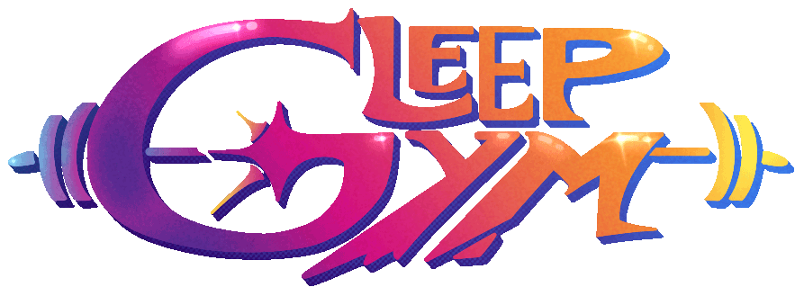
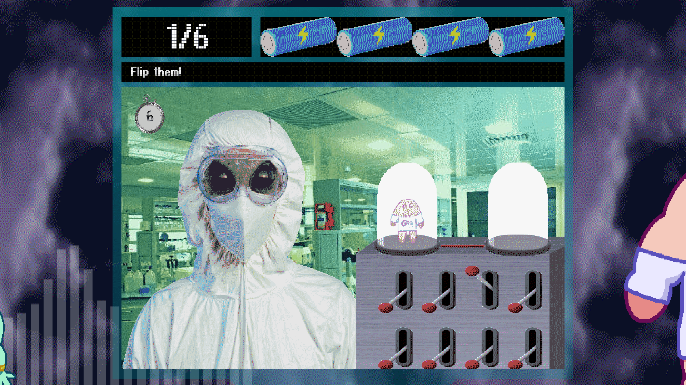
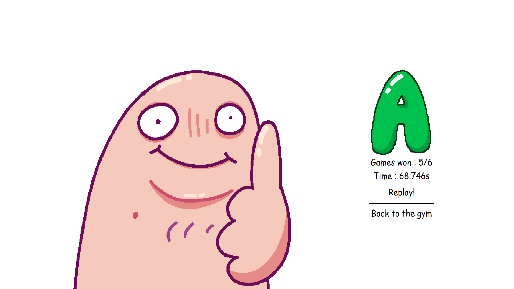
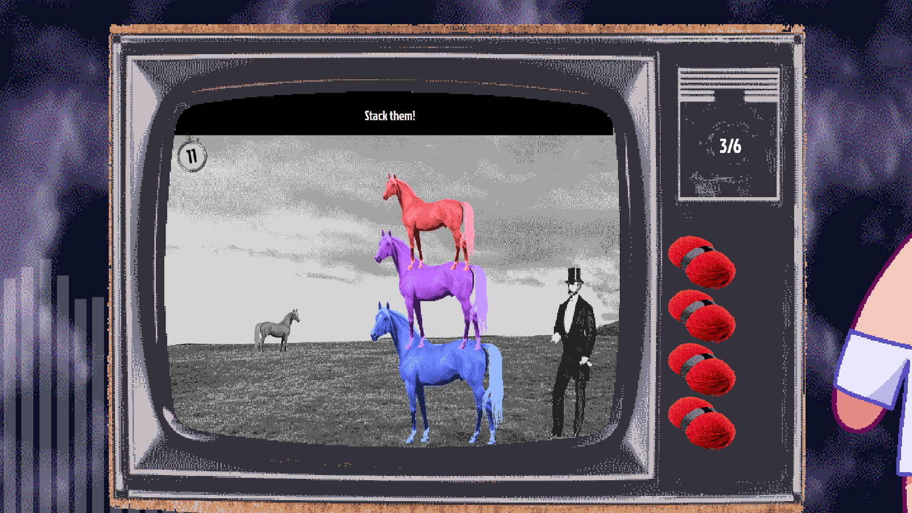
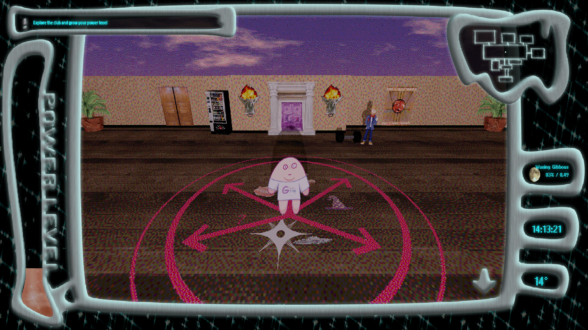
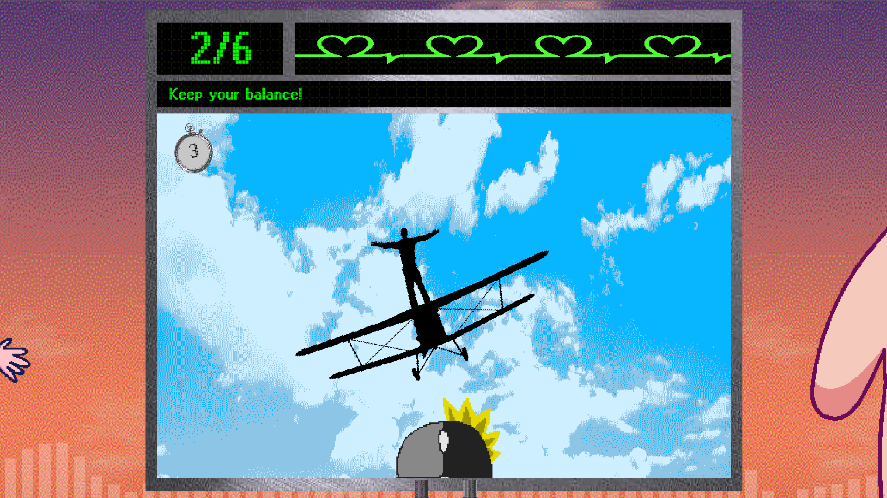
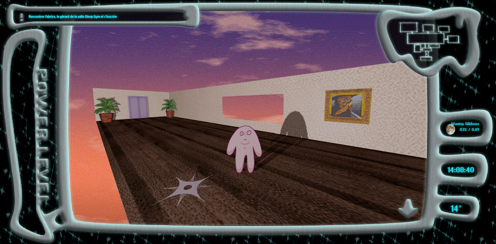

## Reach for the stars in this 00s flash inspired warioware-like !
 Thank you for playing Gleep Gym! This game was created as part of the GameDev.JS 2024 jam in 13 days with the theme 'POWER'.     The game and the website www.gleep-gym.club do not use cookies for tracking and analysis, do not rely on advertising, and do not share information with third parties.    A sequence in the game contains visual effects that may trigger epileptic seizures in some individuals, so please play with caution and consult a healthcare professional if you experience any symptoms.

## Installation
- Install three.js in the public folder (npm i three)
- npm run start to start with webpack & compressed assets
- npm run devstart to fast start
- [Lancer projet](http://localhost:3334/)

## Credits
- MiamoAlex [Website](https://miamoalex.net/)
- Rusalka [Linktree](https://linktr.ee/Rusalkaaa)
- Mo [Instagram](https://www.instagram.com/01001101_01101111/)
- Sukai [Website](https://crylotte.neocities.org/)

## Screenshots

## License
Project under the Creative Commons (CC) Licence in LICENCE.TXT
